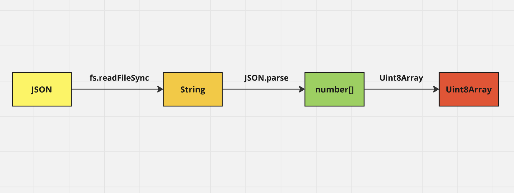

### Step0 Use case

umi is a basic function when we use metaplex.

### Step1 create a umi

use createUmi from @metaplex-foundation/umi-bundle-defaults

### Step2 get a wallet file

1. fs.readFileSync
2. JSON.parse

### Step3 get a key pair

1. umi.eddsa.createKeypairFromSecretKey
2. new Uint8Array

### Step4 Set to umi

1. umi.use
2. keypairIdentity from @metaplex-foundation/umi

#

